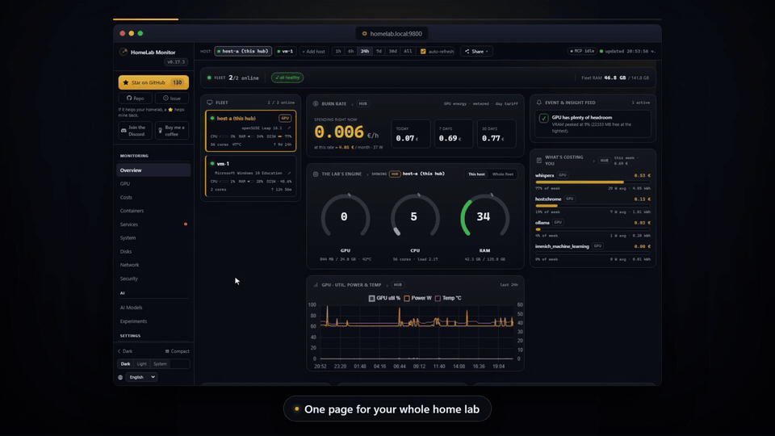
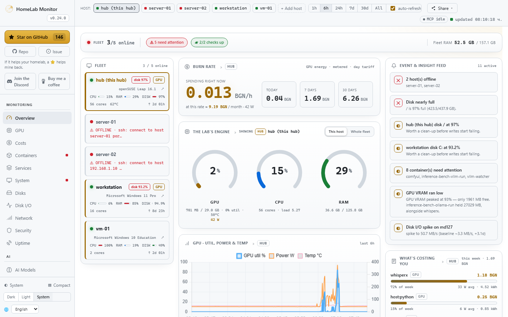
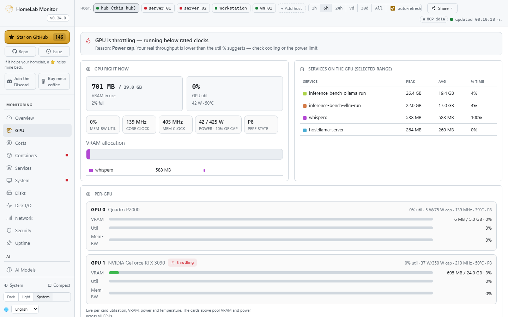
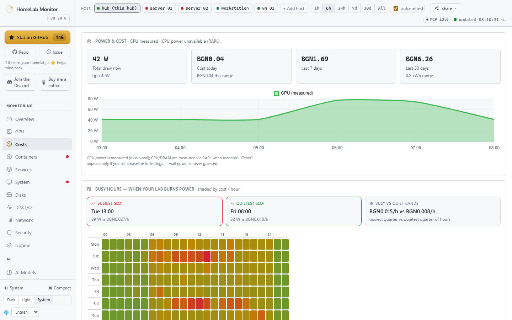
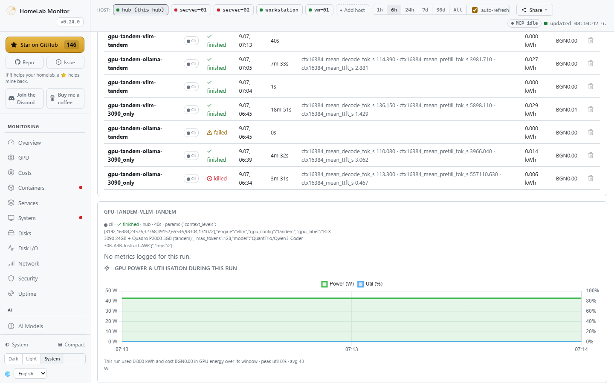

#  HomeLab Monitor

[](https://github.com/SikamikanikoBG/homelab-monitor/stargazers)
[](https://hub.docker.com/r/sikamikaniko123/homelab-monitor)
[](https://discord.gg/tpKWKEdSQN)
[](CHANGELOG.md)


[](https://sikamikanikobg.github.io/homelab-monitor/)

**One page for your whole home lab & AI rig — GPU truth, tokens/sec, power cost, training runs, containers, disks. No agents, no Prometheus/Grafana, no cloud.**

<a href="https://youtu.be/RGUmJlJaOVI"></a>

▶ **[Watch the 1-minute tour on YouTube](https://youtu.be/RGUmJlJaOVI)**

Your home lab grew into a couple of machines, a Pi, and a GPU that's mysteriously always busy — and lately it's running models too. HomeLab Monitor gives you one self-hosted page that answers the real questions: **what's that GPU actually doing, which model is holding it, what's it costing you to run, which container is eating RAM, what's filling your disks**, and **is anything down** — across every box over SSH: Linux, a Pi, even Windows. Readable from your phone over the VPN.

## Get started

```bash
# Grab the compose file and go. No GPU required — the GPU panels just light up when one's present.
curl -fsSLO https://raw.githubusercontent.com/SikamikanikoBG/homelab-monitor/main/docker-compose.yml
docker compose up -d
```

Open `http://<your-host>:9800` and you're done. Full options (from source, GPU toolkit, Windows/WSL2) → [**Install docs**](https://sikamikanikobg.github.io/homelab-monitor/install/).

> 🆕 **v0.16 — the AI Lab Cockpit.** GPU throttle truth, live **tokens/sec**, a per-process **Costs** page, and **push your training runs** from Jupyter/Colab/MLflow — each one priced with the real GPU energy it burned. [Release notes](https://github.com/SikamikanikoBG/homelab-monitor/releases) · [changelog](CHANGELOG.md).

## What you get



One page, every box, the questions you actually have. The classics are all here — and 0.16 builds a whole **AI cockpit** on top of them.

**Your GPU, demystified — and honest about it.** A card pinned at "100% util" can still be throttling, memory-bandwidth-bound, or quietly drooping its clocks. The GPU tab decodes `nvidia-smi`'s throttle reasons (a red banner the moment it's power-capped or too hot), and shows memory-bandwidth util, core/mem clocks, power-vs-limit and p-state — plus *which container is holding the card*.



**What it costs — down to the process.** Power becomes money: per machine, then per component (GPU measured via `nvidia-smi`, CPU/DRAM via RAPL), then **per process, container or model** — click any row to see what it drew and what it cost over any window. Day & night tariffs (Economy 7, Heures Creuses, …), or just pick your country for a sensible estimate. Every watt is measured or a baseline you set; wall power is never guessed.



**Your training runs, priced.** Push a run from Jupyter, Colab or Kaggle with a one-file client (or mirror it from MLflow), and it comes back with the loss curve *and* the real GPU energy it burned, on the same timeline. Create, name, expire and revoke API keys yourself.



And the rest of the lab, the way it always was:

- **Containers, honestly** — health plus **RAM and VRAM in separate columns** (real resident RAM, not page cache), and click one to tail its logs in a side drawer.
- **systemd services** — local or remote, your own units highlighted, failures first.
- **WizTree-style disk treemaps**, **network I/O with per-container top talkers**, and a **mini-htop** for who's eating CPU and RAM.
- **Multi-machine over SSH** — paste one key per box; Linux, a Pi, even **Windows**. No agents, no installs.
- **Push alerts** — **Discord**, **ntfy.sh** and **Telegram**, edge-triggered so they don't spam.

Full tab-by-tab tour → [**Features**](https://sikamikanikobg.github.io/homelab-monitor/features/).

## Multi-machine, in two sentences

Open the **Hosts** tab, paste the hub's auto-generated SSH key onto each remote, and the hub starts polling it — no agents, just SSH + Python 3 (PowerShell on Windows). The hub pipes a small self-contained probe over SSH; nothing persists on the remote.

Onboarding, Windows setup, and the security model → [**Multi-machine docs**](https://sikamikanikobg.github.io/homelab-monitor/multi-host/).

## Configuration

Set these under `environment:` in `docker-compose.yml` (all optional):

| Variable | Default | Meaning |
|---|---|---|
| `SAMPLE_INTERVAL` | `10` | Seconds between samples |
| `RETENTION_DAYS` | `180` | How long history is kept |
| `PRESSURE_FREE_MB` | `2048` | Free VRAM below this counts as "pressure" |
| `PORT` | `9800` | Dashboard port |
| `MCP_PORT` | `9810` | Port for the built-in read-only MCP server |
| `ENABLE_MCP` | `1` | Set `0` to run the dashboard without the MCP server |
| `WATCH_CONTAINERS` | — | Extra containers to scan for OOM (comma-separated) |
| `WATCH_SERVICES` | — | systemd units to always show, even vendor ones (comma-separated) |
| `CHECK_UPDATES` | `true` | Set `false` to disable the daily GitHub-releases check (no outbound calls) |

History lives in `./data/gpu.db` (a bind mount), so it survives restarts and upgrades. Alerts, the systemd D-Bus mount, and per-server tuning → [**Configuration docs**](https://sikamikanikobg.github.io/homelab-monitor/configuration/).

## Under the hood

The hub stitches `nvidia-smi`, the Docker API, model-server APIs (Ollama, vLLM, llama.cpp, A1111, …), systemd D-Bus, and `/proc` + `/sys` into one sampled view, persisted to SQLite and downsampled on read so a six-month range loads as fast as the last hour. Single page, vendored Chart.js, no build step.

- **30+ recognised model servers** → [Model servers](https://sikamikanikobg.github.io/homelab-monitor/model-servers/)
- **`/metrics` Prometheus endpoint + Grafana dashboard** → [Prometheus & Grafana](https://sikamikanikobg.github.io/homelab-monitor/prometheus/)
- **The full data pipeline + caller attribution** → [How it works](https://sikamikanikobg.github.io/homelab-monitor/how-it-works/)

## Connect an AI agent (MCP)

**Your homelab is now legible to AI agents — point a client at one URL and it can see every host, container, GPU and disk. Read-only, no extra setup.**

HomeLab Monitor isn't just a dashboard for *you* anymore; it's context for your AI agent too. A **read-only [MCP](https://modelcontextprotocol.io) server is built into the same container** (served on `:9810`) — so Claude, Claude Code, or any MCP client connects in one line and explores your whole lab through **12 named tools**, with the same coverage you see on the dashboard: hosts, containers, systemd services, GPU **and who's driving it**, per-process RAM, AI model servers, disk treemaps, history and alerts.

<p align="center"></p>

<p align="center"><sub>Connect any MCP client — Claude, ChatGPT, or an agent on your own local Ollama models — and it reads your homelab's live state. Read-only: both directions are just question and answer.</sub></p>

```bash
# the dashboard is on :9800; the MCP server rides along on :9810
claude mcp add --transport http homelab http://YOUR-HUB:9810/mcp
```

Once connected, skip the tab-hunting and just **ask** — the agent picks the right tools:

- *"My GPU's been pinned for an hour — which model server is loaded, and who's actually calling it?"*
- *"What's eating `/backup`? Give me the biggest folders and flag anything that looks like runaway logs."*
- *"Which host is lowest on RAM right now, and what's the top process holding it?"*
- *"I want to reboot and run an OS upgrade this weekend — which box needs it most, and what's a safe order given what's running on each?"*

**Read-only by design** — there are no write tools, so an agent can look but never touch your fleet. Turn it off anytime with `ENABLE_MCP=0`. Full tool list & setup → [MCP docs](https://sikamikanikobg.github.io/homelab-monitor/mcp/).

## Security

This is a host monitor: it runs with host access and a read-only Docker socket, root mount, and D-Bus socket — a broad footprint by design. **Keep it behind your LAN/VPN/firewall and don't expose it to the public internet.** Details → [docs](https://sikamikanikobg.github.io/homelab-monitor/how-it-works/).

## ⭐ Support the project

If HomeLab Monitor saves you a browser tab or two, a ⭐ on GitHub genuinely helps other home-labbers find it. Thank you!

<a href="https://www.star-history.com/?repos=SikamikanikoBG%2Fhomelab-monitor&type=date&legend=top-left">
 <picture>
   <source media="(prefers-color-scheme: dark)" srcset="https://api.star-history.com/chart?repos=SikamikanikoBG/homelab-monitor&type=date&theme=dark&legend=top-left" />
   <source media="(prefers-color-scheme: light)" srcset="https://api.star-history.com/chart?repos=SikamikanikoBG/homelab-monitor&type=date&legend=top-left" />
   
 </picture>
</a>

## 💬 Community

Building this is more fun together. **[Join the HomeLab Monitor Discord](https://discord.gg/tpKWKEdSQN)** — say hi, show off your rig, swap ideas, ask for help, or just hang out. It's where the roadmap chatter, “should we build X?” questions, and quick help happen — and where new contributors get a warm welcome.

[](https://discord.gg/tpKWKEdSQN)

Bring a friend, post an idea, open an issue — let's grow a friendly, healthy homelab community. 💛

## Contributing

Issues and PRs are very welcome — especially new model-server probes, new monitors, and GPU back-ends. This is a hobby tool meant to help fellow home-labbers, so be kind. See [CONTRIBUTING.md](CONTRIBUTING.md).

## License

MIT — see [LICENSE](LICENSE).
