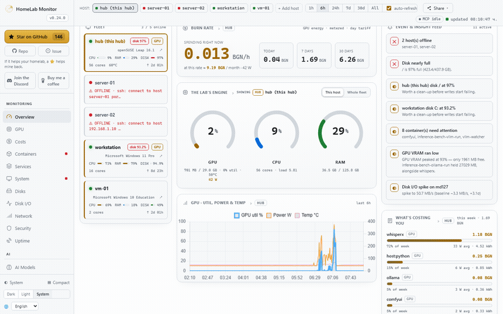

#  HomeLab Monitor — the AI-native HomeLab cockpit

[](https://github.com/SikamikanikoBG/homelab-monitor/stargazers)
[](https://hub.docker.com/r/sikamikaniko123/homelab-monitor)
[](https://discord.gg/tpKWKEdSQN)
[-blue)](CHANGELOG.md)


**One self-hosted page for your whole home lab & AI rig — that also *thinks*. GPU truth, live tokens/sec, power cost, training runs, containers, disks, uptime — plus a local-LLM Copilot that tells you what's wrong, forecasts what's about to break, and groups related anomalies into incidents. Single image, pure Python, read-only by default, no cloud.**

> ℹ️ **You're reading the `next_ai` preview line (v0.18.0-ai).** It builds an **AI-native cockpit** on top of the classic monitor. Everything documented here is shipped and live. The DNA is unchanged: **one container, pure Python + Flask, no heavy deps, read-only by default — every outbound action and integration is opt-in and OFF by default.**



---

## Try the demo in one command

No GPU, no SSH, no config — `DEMO_MODE=1` seeds ~7 days of believable synthetic history (a filling disk, a deliberate power spike, model VRAM, a tariff) so forecasting, anomalies, incidents, the cost heatmap and the Copilot digest all light up immediately:

```bash
docker run --rm -e DEMO_MODE=1 -p 9800:9800 sikamikaniko123/homelab-monitor:latest
```

Then open **`http://localhost:9800`** and look at the **Overview** hero, **GPU** forecasts/anomalies, the **Costs** heatmap, and the public **[`/status`](http://localhost:9800/status)** page. Demo mode is OFF by default and never touches a real instance's history (it only seeds a fresh DB).

> Building from this branch instead? `DEMO_MODE=1 PORT=9800 ENABLE_MCP=0 python app.py` runs it with no Docker at all (Python 3.12, `pip install flask`).

---

## Why it's different: the AI-native cockpit

Most monitors draw graphs and leave the thinking to you. This one reasons about your lab — all of it on-box, no cloud, no API keys.

### 🧠 Lab Copilot — local LLM, no cloud
Grounded in your *real* metrics (it never makes numbers up), powered by the on-box [ollama](https://ollama.com) you already run.

- **Daily digest & ask-box** — a plain-English summary (GPU, biggest model, disk-fill ETA, cost projection, top anomaly) and a free-text Q&A box.
- **"Explain this spike"** — click any anomaly or incident member; the Copilot reads the surrounding samples, models and power draw and gives you a one-line cause.
- **"What's broken?" — one keystroke** (⌘K) — scores every container by badness, opens the worst one's logs, and auto-summarizes the errors with the LLM.
- **Container log tail + "Summarize errors"** — Dozzle-style log viewing over the read-only Docker socket, with one-click local-LLM triage.

### 🔮 Forecasting, anomalies & incidents (pure stats, zero deps)
- **ETAs that matter** — disk-fill date per mount, VRAM-exhaustion ETA + headroom, and a tariff-aware **cost-this-month** projection (vs last month). All R²-gated so they only forecast a credible trend.
- **Z-score anomalies** on GPU util / VRAM / power / temp + total draw, with per-series floors so idle and noise never false-alarm — drawn as a heat-ribbon under the charts.
- **Correlated incidents** — co-firing anomalies are grouped into one life-cycled **Incident** (open → cleared) with a detail drawer, lifecycle timeline, per-member σ, and a single recovery notification — instead of N separate pings.

### ⚡ Live LLM inference telemetry
The most on-brand metric a GPU/AI homelab can show, and no gauge dashboard does it inline:

- **Live tokens/sec · TTFT · resident models** — measured honestly from your own Copilot generations (ollama's nanosecond timing fields), never fabricated; plus a live resident-model list (VRAM, GPU/CPU offload, keep-alive countdown) from ollama `/api/ps`.
- **tok/s sparkline** on the GPU card, and `homelab_llm_tokens_per_second` / `homelab_llm_ttft_ms` on `/metrics`.

---

## And the full breadth of a monitor


| Area | What you get |
|---|---|
| **GPU, demystified** | Decodes `nvidia-smi` throttle reasons (red banner the moment it's power-capped or too hot), memory-bandwidth util, core/mem clocks, power-vs-limit, p-state — and *which container is holding the card*. |
| **Cost, to the process** | Power → money per machine, per component (GPU via `nvidia-smi`, CPU/DRAM via RAPL), then **per process / container / model**. Day & night tariffs. A **busy-vs-quiet cost heatmap** (7×24). Wall power is measured, never guessed. |
| **Training runs, priced** | Push a run from Jupyter/Colab/Kaggle (or mirror from MLflow) → loss curve **and** the real GPU energy it burned, on one timeline. |
| **Alerting & recovery** | Opt-in rules (anomaly / disk-ETA / VRAM-ETA / cost-budget / incident / uptime-down) × channels (**Discord · ntfy · Telegram · webhook**) with dedupe, cooldown, snooze, ack, history and ✅ recovery notifications. |
| **Maintenance windows** | One-off or recurring-daily windows that mute alerts (and defer recoveries) for nightly restarts — without touching the host. |
| **Uptime checks** | Uptime-Kuma-in-the-box: user-defined HTTP/TCP monitors probed from inside the container → up/down + latency + 24h uptime% + heartbeat strips, with `uptime_down` alerting. |
| **Containers & services** | Health, **RAM and VRAM in separate columns** (real resident RAM), click to tail logs; systemd units local or remote, failures first. |
| **Disks, network, processes** | WizTree-style disk treemaps, network I/O with per-container top talkers, a mini-htop for who's eating CPU/RAM. |
| **Multi-machine over SSH** | Paste one key per box — Linux, a Pi, even **Windows** (PowerShell). No agents, nothing persists on the remote. |

---

## Integrations — your lab, everywhere

- **Prometheus / OpenMetrics `/metrics`** — a pure-stdlib `homelab_*` block (GPU/power/disk/cost/anomaly/LLM gauges + `homelab_build_info`); works with or without `prometheus_client`. Grafana-ready.
- **Home Assistant / MQTT auto-discovery** — optional, **publish-only** stdlib MQTT 3.1.1 client. It *never subscribes*, so there's no inbound command/attack surface; the lab appears as native HA sensors (GPU util/VRAM/power/temp, total power, disk fill%, cost, anomaly-active, uptime) under one device. OFF until configured.
- **Built-in read-only MCP server** — point any [MCP](https://modelcontextprotocol.io) client (Claude, Claude Code, …) at one URL and it reads your whole fleet: hosts, containers, services, GPU + who's driving it, per-process RAM, model servers, disk treemaps, history, incidents and alerts. **Read-only by design — no write tools.**

```bash
# the dashboard is on :9800; the MCP server rides along on :9810
claude mcp add --transport http homelab http://YOUR-HUB:9810/mcp
```

<p align="center"></p>

---

## UX that makes it a cockpit

- **Overview hero** — a status orb + KPI strip (GPU busy%, GPU power, projected monthly cost, soonest disk-fill ETA) + a live active-incident chip.
- **⌘K command palette** — Linear/Raycast-style fast-nav and actions: jump to any tab, switch theme/language, run Copilot, open incidents, deep-link `/status` & `/metrics`.
- **Time-range control** — 1h / 6h / 24h / 7d / 30d / All across every chart, persisted, with an honest "limited by retained history" hint.
- **Public `/status` page** — a no-auth, shareable "is my lab up?" surface with **uptime heartbeat bars**, privacy-first (no hostnames/IPs/mountpoints/names/costs/secrets ever leave it).
- **Demo mode**, **dark / light / system**, mobile reflow, accessibility throughout, and **i18n (English + Simplified Chinese)** for every string.

---

## Get started for real

```bash
# Grab the compose file and go. No GPU required — the GPU panels just light up when one's present.
curl -fsSLO https://raw.githubusercontent.com/SikamikanikoBG/homelab-monitor/main/docker-compose.yml
docker compose up -d
```

Open `http://<your-host>:9800`. Full options (from source, GPU toolkit, Windows/WSL2) → [**Install docs**](https://sikamikanikobg.github.io/homelab-monitor/install/).

### Multi-machine, in two sentences
Open the **Hosts** tab, paste the hub's auto-generated SSH key onto each remote, and the hub starts polling it — no agents, just SSH + Python 3 (PowerShell on Windows). The hub pipes a small self-contained probe over SSH; nothing persists on the remote. → [**Multi-machine docs**](https://sikamikanikobg.github.io/homelab-monitor/multi-host/).

### Configuration

Set these under `environment:` in `docker-compose.yml` (all optional):

| Variable | Default | Meaning |
|---|---|---|
| `SAMPLE_INTERVAL` | `10` | Seconds between samples |
| `RETENTION_DAYS` | `180` | How long history is kept |
| `PRESSURE_FREE_MB` | `2048` | Free VRAM below this counts as "pressure" |
| `PORT` | `9800` | Dashboard port |
| `MCP_PORT` | `9810` | Port for the built-in read-only MCP server |
| `ENABLE_MCP` | `1` | Set `0` to run the dashboard without the MCP server |
| `STATUS_PAGE` | `1` | Set `0` to disable the public `/status` page (→ 404) |
| `DEMO_MODE` | — | Set `1` to seed synthetic history on a **fresh** DB (for demos) |
| `WATCH_CONTAINERS` | — | Extra containers to scan for OOM (comma-separated) |
| `WATCH_SERVICES` | — | systemd units to always show, even vendor ones (comma-separated) |
| `CHECK_UPDATES` | `true` | Set `false` to disable the daily GitHub-releases check (no outbound calls) |

History lives in `./data/gpu.db` (a bind mount), so it survives restarts and upgrades. Alerts, the systemd D-Bus mount, MQTT, and per-server tuning → [**Configuration docs**](https://sikamikanikobg.github.io/homelab-monitor/configuration/).

---

## Under the hood

The hub stitches `nvidia-smi`, the Docker API, model-server APIs (Ollama, vLLM, llama.cpp, A1111, …), systemd D-Bus, and `/proc` + `/sys` into one sampled view, persisted to SQLite and downsampled on read so a six-month range loads as fast as the last hour. **Single page, vendored Chart.js, no build step. Forecasting, anomaly scoring, incidents and the MQTT client are all pure-stdlib — no NumPy, no Pandas, no broker library.**

- **30+ recognised model servers** → [Model servers](https://sikamikanikobg.github.io/homelab-monitor/model-servers/)
- **`/metrics` Prometheus endpoint + Grafana dashboard** → [Prometheus & Grafana](https://sikamikanikobg.github.io/homelab-monitor/prometheus/)
- **The full data pipeline + caller attribution** → [How it works](https://sikamikanikobg.github.io/homelab-monitor/how-it-works/)

## Security

This is a host monitor: it runs with host access and a read-only Docker socket, root mount, and D-Bus socket — a broad footprint by design, and **read-only**: it never mutates your fleet, and every outbound integration (alerts, MQTT, digest push, uptime checks) is opt-in and OFF until you turn it on. **Keep it behind your LAN/VPN/firewall and don't expose it to the public internet.** Details → [docs](https://sikamikanikobg.github.io/homelab-monitor/how-it-works/).

## ⭐ Support the project

If HomeLab Monitor saves you a browser tab or two, a ⭐ on GitHub genuinely helps other home-labbers find it. Thank you!

## 💬 Community

Building this is more fun together. **[Join the HomeLab Monitor Discord](https://discord.gg/tpKWKEdSQN)** — say hi, show off your rig, swap ideas, ask for help, or just hang out.

[](https://discord.gg/tpKWKEdSQN)

## Contributing

Issues and PRs are very welcome — especially new model-server probes, new monitors, and GPU back-ends. This is a hobby tool meant to help fellow home-labbers, so be kind. See [CONTRIBUTING.md](CONTRIBUTING.md).

## License

MIT — see [LICENSE](LICENSE).
